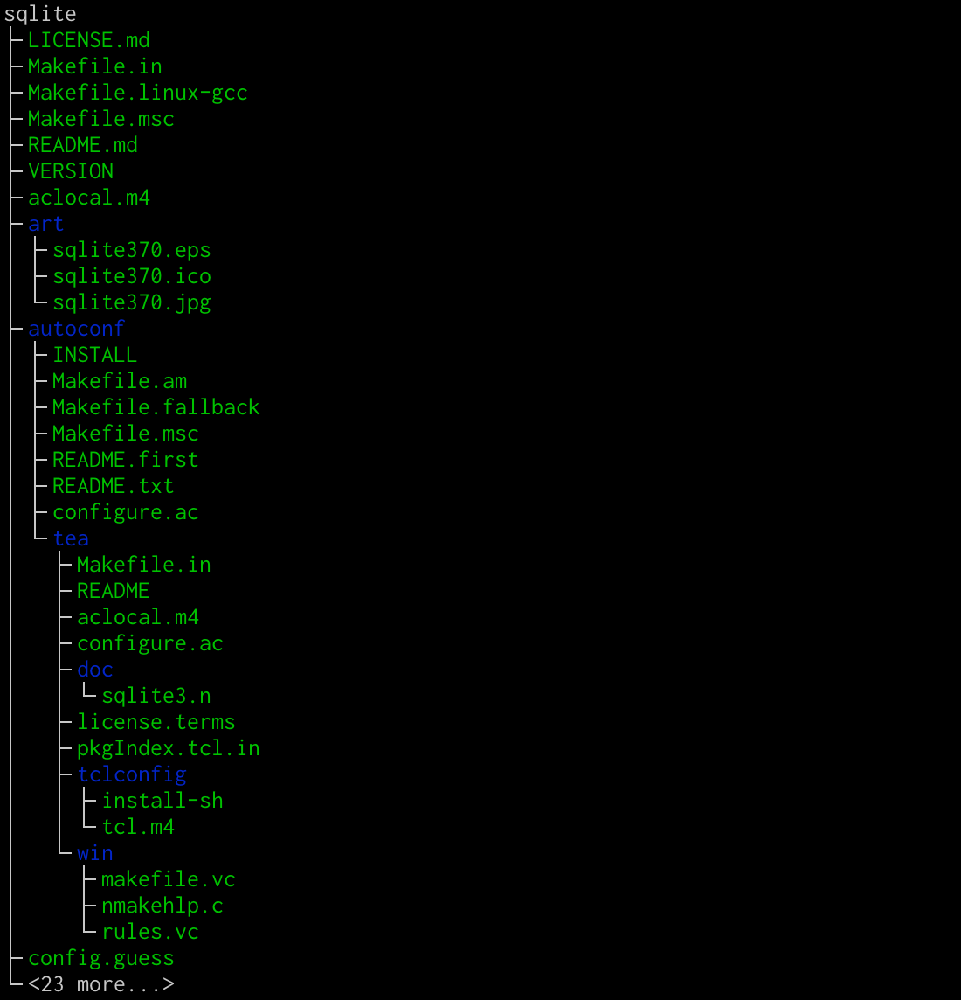
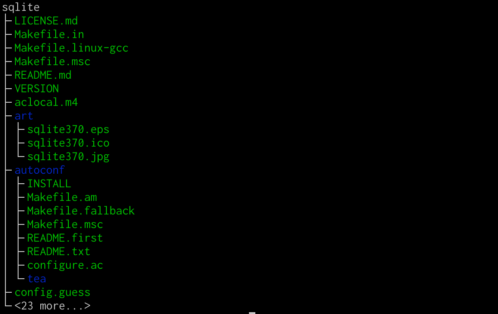

# treeview
A simple python script for displaying a filesystem hierarchy as a tree

## Example
This example displays the SQLite3 source tree.
`cd` into the directory containing `sqlite` and run

```bash
python3 treeview.py -n 10 ./sqlite
```

We see as our output:


As shown above, the number of entries printed in each directory has been limited to 10 using the `-n` option.

Similarly, we can specify the number of levels to show using the `-L` option.
We write:

```bash
python3 treeview.py -n 10 -L 2 ./sqlite
```

This causes the two levels to be printed:


## Tests
To run the tests, `cd` into `test` and run 

```bash
bash test.sh
```

The script will create an example directory tree and run `treeview` on it with different arguments, `diff`ing the results with hand-typed trees from `test/answers`.
If a test fails, its name and the location of its `diff` output will be reported.

## Contributing
There are a lot of cool features that could be added.
Feel free to create a pull request if you'd like to contribute.
